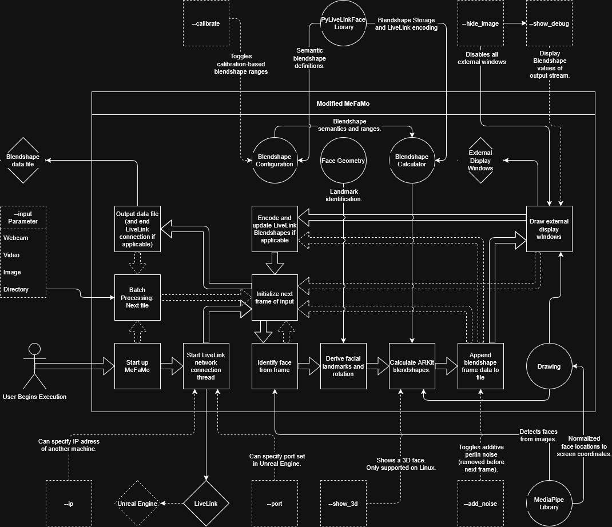

# Introduction
This are two programs as part of a larger VIP on multi-modal facial transfer, a fork of [MeFaMo](https://github.com/JimWest/MeFaMo) and an Unreal Engine 5.7.4 Project including a blendshape to video pipeline.
The modified MeFaMo represents the facial motion capture input of the overall project with the goal was to take an existing framework's ability of calculating blendshapes that contribute to facial movements such as blinking, smiling, raising an eyebrow, etc, and refine and automate it for batch processing.
The blendshape to video pipeline

# Architectural Diagram ~ Modified MeFaMo

The modified MeFaMo uses a lot of parameters to determine several behaviors, such as what it should display on the host machine, what to connect LiveLink to, and if to bake (subtle) additive perlin noise to certain blendshapes. In particular, passing in a directory as its input activates a batch processing pipeline, which disables LiveLink and external display windows to save on performance.
When MeFaMo is started up, after determining if to use batch processing, it initiates a LiveLink network connection with an optionally-given IP address and port set in Unreal Engine. By default, these would point to the machine MeFaMo is running from, where both it and Unreal Engine would be running on the same machine. Unreal Engine is not required for MeFaMo to run.
It next opens up the input media (integer for webcam, path for image and video) and begin processing at the first frame of input. If Mediapipe detects a face, the included Face Geometry helper-program identifies facial landmarks located relative to the face itself (rather than screen coordinates). While Mediapipe is able to detect multiple faces, it is set to only detect a single face as the LiveLink network is single threaded. In addition, the --show3d parameter can display all of the landmarks in a standalone window. However, certain Open3D functions that make this work, namely OffscreenRenderer() in drawing.py, are exclusively supported on Linux-based operating systems.
The Blendshape Calculator then uses these landmarks to calculate blendshapes in Apple's ARKit format (as seen in [LiveLinkFace App](https://apps.apple.com/us/app/live-link-face/id1495370836)) and stores them using original creator's [PyLiveLinkFace](https://github.com/JimWest/PyLiveLinkFace) library for interpolation.
Once calculation is finished, the calculated blendshapes are appended to a matrix that will eventually result in an output data file. Right before that, if the --add_noise parameter is passed, subtle additive perlin noise will be baked to certain blendshapes to have the certain parts of the face (i.e. pupils, lips, and nose sneer) move very slightly even when the face is otherwise still, something the facial motion capture alone can struggle to detect.
Unless the --hide_image parameter is passed or batch processing is enabled, external windows are displayed. Depending on the parameters passed through the command line, this includes the playabck of the media, a display of the blendshape output stream for debugging, and all of the aforementioned landmarks through Open3D. This is handled exclusively by cv2, included in the [opencv-python library](<https://pypi.org/project/opencv-python/>).
Unless batch processing is enabled, PyLiveLinkFace then encodes and passes the blendshapes through LiveLink, effectively maintaining an output stream. Lastly, if noise was added earlier, it is removed as to not skew PyLiveLinkFace's interpolation.
From there, the next frame of input is processed. Once all of the frames have been processed or the user exits the program with CTRL+C, the program ends the LiveLink connection and creates the finalized blendshape "out.csv" data file located in the project's root directory. If batch processing is enabled, this the data file is instead located within an "out" directory within the parent of the aforementioned directory as MeFaMo begins again with a new video/image file, where the program ends after all files are processed.

# Architectural Diagram ~ Blendshape to Video Pipeline

The overall scope of the blendshape to video pipeline is simpler, for the bare minimum that is needed is a machine and Unreal Engine with certain plugins and extensions (namely the MetaHuman, LiveLink, and ARKit ones) enabled. It is an Editor Ultility Widget, so it needs to be started before executed.
After pressing the big button that encompasses the entire Widget, it first cleans up some leftover that may have been left due to premature exiting (can be user-initiated by stopping the Widget from the Widget builder). From there, It begins execution of the main loop that encompasses all functionality for every file present in a predefined directory. These should all be valid blendshape data files imported as Level Sequences with the LiveLinkFaceImporter plugin as there are currently no checks that they are.
Before it begins rendering, it initializes a random MetaHuman from another predefined directory (same situation as the blendshape data directory) by spawning it into the Scene, toggling on its LiveLink and ARKit properties, and heuristically setting the camera to match eye level. Since these properties and heuristics behind camera height were made with MetaHumans and their proportions in mind, other subjects are currently unsupported.
After which, the loop begins a single thread for rendering and waits for a signal that is triggered when rendering is finished to move on. This is effectively iterative, but it was programmed this way as other methods caused every file to be rendered at once, which proved to be unsustainable. The rendering processes adds the Level Sequence (the imported blendshape data file) to the Scene and assigns the MetaHuman LiveLink subject to that Sequence. Next, using the Movie Render Queue plugin, it adds the Scene to the queue (after clearing the queue just in case), setting the name of the output file to be derived from the blendshape data file name and the current date. Finally, after printing out time remaining based on files done and time taken as a visual indicator of progress, it begins playback of the Scene for rendering. The movie pipeline configuration is predefined to create an .mp4 file from .jpg images of each rendered frame using [FFmpeg](https://ffmpeg.org) (the Windows executable, to be specific). It also specifies going through few frames of warmup before rendering begins to prevent the MetaHuman from starting from its neutral state due to in-engine interpolation. All output video files will be located within the "\game\Saved\MovieRenders" directory.
Once rendering is complete and the trigger to move on is enabled, it cleans up the scene to make way for the next data file and MetaHuman by removing them from the scene and removing all jobs from the Movie Render Queue. From there, the cycle begins anew until all data files are processed.

# Toolkits, Libraries, and Software Dependencies
## Toolkits
MeFaMo does not need Unreal Engine to work, but it was largely made with Unreal Engine's MetaHumans in mind; It has been untested on other 3D models or on other software. For those who want to develop it further, the modified MeFaMo was developed with [VSCodium](<https://vscodium.com/>), but any IDE would ideally work.
As for the blendshape to video pipeline, the pipeline was built in Unreal Engine 5.7.4 as a Editor Ultility Widget, and so Unreal Engine is required.

## Software Dependencies
Some of the Python libraries that made the original MeFaMo have been deprecated, and so the modified MeFaMo was developed with Python 3.8.10. Following this, later versions of Python (i.e. 3.9.XX) may not be able to run this program from its source code.
In addition, the blendshape to video pipeline uses a Windows FFmpeg executable. If on another operating system, look into the Movie Pipeline CLI Encoder section of the Unreal Project settings and try to include the OS-specific version of FFmpeg into the "Executable Path" field. Cross-platform support has not yet been implemented, so the mileage may vary.

## Libraries
From there, installing the following libraries as is (through requirements.txt) should be sufficient:
<ul>
    <li>numpy</li>
    <li>opencv-python (cv2)</li>
    <li>pylivelinkface</li>
    <li>mediapipe</li>
    <li>transforms3d</li>
    <li>open3d</li>
    <li>pandas</li>
    <li>perlin</li>
</ul>

For the blendshape to video pipeline, the Unreal Engine Project associated with it should be portable (albeit extremely large), only needing to have Unreal Engine (5.7) and its MetaHuman support installed on the system. The MetaHuman support is required, as the pipeline currently only considers MetaHumans as possible subjects (for reasons mentioned above). With this, the Project should work right out of the box, as all of the plugins should automatically be enabled for the project. If they are not, try looking for the following plugins:
<ul>
    <li>LiveLinkFaceImporter</li>
    <li>Movie Render Queue</li>
    <li>MetaHuman Animator</li>
    <li>MetaHuman Creator (for adding MetaHumans)</li>
    <li>MetaHuman LiveLink</li>
    <li>Apple ARKit Face Support</li>
</ul>
This is not a complete list of plugins, but all of the higher-level ones that ideally should encompass all functionality of the Project from a fresh installation.

# Reflection
I haven't been in a VIP before, but I have done research through working on an emerging project before (Professor Abeer's tag-to-tag backscatter network simulation tools). Similarly, my experiences here and with the former project both involved larning an existing framework and project snapshot and building on top of it (not to mention both of them being in python), something I feel is common in industry practice. In that regard, I felt I was a lot quicker in adapting to a new codebase than that former project, and I really enjoyed that in the grand learning experience; It felt rewarding to build these skills, even if project adaptability isn't necessarily technical. This was also my first time working with Mediapipe and ARKit, facial motion capture technology was something I was decently interested in but ionly knew vaguely about, so it was nice to learn those from a technical side as well.
This was also my first time working with Unreal Engine, something I was honestly a tad adverse to due to the amount of features it boasted and processing power it needed. However, I have had previous experiences that made the learning experience rather reasonable. For the UI, I've taken a Unity class for my Game Development minor that taught me what to know about Scene arrangement and editing the macro-object blueprints. For the Editor Ultility Widget's Blueprint visual programming language, it would be first I have been exposed to one since Scratch if not for a computer graphics seminar class where I worked in TouchDesigner, although the specifics of how it functions, especially when working with the Movie Render Queue, was learned along the way. Most of the remaining technical learning experience with Unreal Engine was spent with Level Sequences and how they work as LiveLink subjects for MetaHumans. Some time was also spent working with VR before the pivot to the pipeline was made. Overall, while I would still like for Unreal Engine to be more optimized and more friendly towards lower-spec machines, I can really see why it is one of the most pravalent game and multimedia creation engines of the present day, especially with how MetaHumans and their developer-friendly customization work naitively with it.
In addition, this VIP counted as a co-op through research provided by UR2PhD. I applied and was invited to their first ever research showcase and felt it was a great learning experience from a professional, non-technical point of view. It was very insightful about how industry is not the only end-point of one's computing career, something UR2PhD is all about that hadn't clicked until I attended the event. It was also nice to be part of a project that leads itself into everyone filling in for a specific niche (i.e. working with a different modality of input for the final model), it really allows for teammates feel their worth and consider each perspective uniquely.